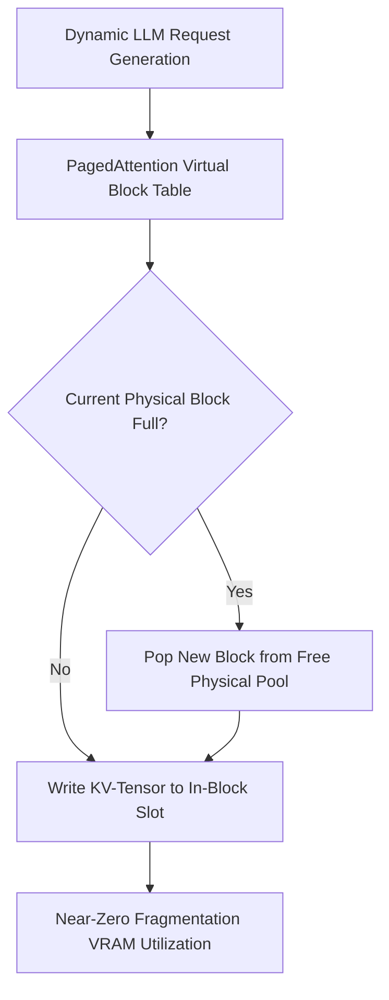

# GenPark AI Agent Skill - PagedAttention KV-Cache Block Allocator

Simulates PagedAttention non-contiguous virtual memory block table allocation for dynamic KV-cache management.

Verified by [GenPark AI](https://genpark.ai) and compatible with [Model Context Protocol (MCP)](https://genpark.ai/mcp).

## Architecture Diagram

## Features
- **OS Paging Semantics**: Maps logical token indices to physical block frames without requiring continuous memory.
- **Zero External Dependencies**: Pure Python 3.9+ standard library.
